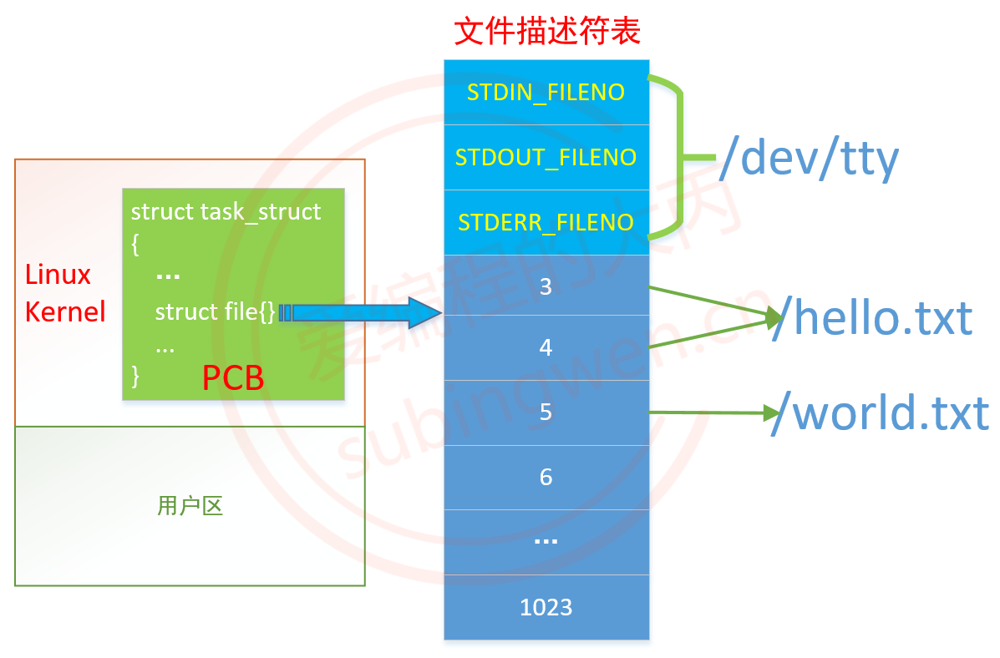

# Linux 编程基础
> 该项目包括三大部分：
> - 文件与目录
> - 进程与线程
> - Socket编程
> 
环境： `Ubuntu22.04,  C++17, Clion, CMake`.
## 1  文件与目录

### 1.1 文件操作
#### a. 文件描述符

&nbsp;&nbsp;在 Linux 操作系统中的一切都被抽象成了文件，那么一个打开的文件是如何与应用程序进行对应呢？解决方案是使用文件描述符（file descriptor，简称fd），当在进程中打开一个现有文件或者创建一个新文件时，内核向该进程返回一个文件描述符，用于对应这个打开/新建的文件。这些文件描述符都存储在内核为每个进程维护的一个文件描述符表中。

&nbsp;&nbsp;在程序设计中，一些涉及底层的程序编写往往会围绕着文件描述符展开。但是文件描述符这一概念往往只适用于 UNIX、Linux 这样的操作系统。

> &nbsp;在 Linux 系统中一切皆文件，系统中一切都被抽象成了文件。对这些文件的读写都需要通过文件描述符来完成。标准 C 库的文件 IO 函数使用的文件指针 FILE* 在 Linux 中也需要通过文件描述符的辅助才能完成读写操作。FILE 其实是一个结构体，其内部有一个成员就是文件描述符（下面结构体的第 25 行）。

```c++
// linux c FILE结构体定义： /usr/include/libio.h
struct _IO_FILE {
  int _flags;		/* High-order word is _IO_MAGIC; rest is flags. */
#define _IO_file_flags _flags
 
  /* The following pointers correspond to the C++ streambuf protocol. */
  /* Note:  Tk uses the _IO_read_ptr and _IO_read_end fields directly. */
  char* _IO_read_ptr;	/* Current read pointer */
  char* _IO_read_end;	/* End of get area. */
  char* _IO_read_base;	/* Start of putback+get area. */
  char* _IO_write_base;	/* Start of put area. */
  char* _IO_write_ptr;	/* Current put pointer. */
  char* _IO_write_end;	/* End of put area. */
  char* _IO_buf_base;	/* Start of reserve area. */
  char* _IO_buf_end;	/* End of reserve area. */
  /* The following fields are used to support backing up and undo. */
  char *_IO_save_base; /* Pointer to start of non-current get area. */
  char *_IO_backup_base;  /* Pointer to first valid character of backup area */
  char *_IO_save_end; /* Pointer to end of non-current get area. */
 
  struct _IO_marker *_markers;
 
  struct _IO_FILE *_chain;
 
  int _fileno;			// 文件描述符
#if 0
  int _blksize;
#else
  int _flags2;
#endif
  _IO_off_t _old_offset; /* This used to be _offset but it's too small.  */
 
#define __HAVE_COLUMN /* temporary */
  /* 1+column number of pbase(); 0 is unknown. */
  unsigned short _cur_column;
  signed char _vtable_offset;
  char _shortbuf[1];
 
  /*  char* _save_gptr;  char* _save_egptr; */
 
  _IO_lock_t *_lock;
#ifdef _IO_USE_OLD_IO_FILE
};

// 在文件: /usr/include/stdio.h
typedef struct _IO_FILE FILE;
```
#### b. 文件描述符表

​	内核为每一个进程维护了一个文件描述符表，索引表中的值都是从 0 开始的，所以在不同的进程中你会看到相同的文件描述符，但是它们指向的不一定是同一个磁盘文件。




<font color="red">**打开的最大文件数：**</font>

​	每一个进程对应的文件描述符表能够存储的打开的文件数是有限制的，默认为 1024 个，这个默认值是可以修改的，支持打开的最大文件数据取决于操作系统的硬件配置。

<font color="red">**默认分配的文件描述符：**<font>

​	当一个进程被启动之后，内核 PCB 的文件描述符表中就已经分配了三个文件描述符，这三个文件描述符对应的都是当前启动这个进程的终端文件（Linux 中一切皆文件，终端就是一个设备文件，在 /dev 目录中）.

> `STDIN_FILENO`：标准输入，可以通过这个文件描述符将数据输入到终端文件中，宏值为 0。
> `STDOUT_FILENO`：标准输出，可以通过这个文件描述符将数据通过终端输出出来，宏值为 1。
> `STDERR_FILENO`：标准错误，可以通过这个文件描述符将错误信息通过终端输出出来，宏值为 2。

这三个默认分配的文件描述符是可以通过 close() 函数关闭掉，但是关闭之后当前进程也就不能和当前终端进行输入或者输出的信息交互了。

<font color="red">**给新打开的文件分配文件描述符：**<font>

​	因为进程启动之后，文件描述符表中的 0,1,2 就被分配出去了，因此从 3 开始分配。在进程中每打开一个文件，就会给这个文件分配一个新的文件描述符，比如：通过 open() 函数打开 /hello.txt，文件描述符 3 被分配给了这个文件，保持这个打开状态，再次通过 open() 函数打开 /hello.txt，文件描述符 4 被分配给了这个文件，也就是说一个进程中不同的文件描述符打开的磁盘文件可能是同一个。
​	通过 open() 函数打开 /hello.txt，文件描述符 3 被分配给了这个文件，将打开的文件关闭，此时文件描述符 3 就被释放了。再次通过 open() 函数打开 /hello.txt，文件描述符 3 被分配给了这个文件，也就是说打开的新文件会关联文件描述符表中最小的没有被占用的文件描述符。
